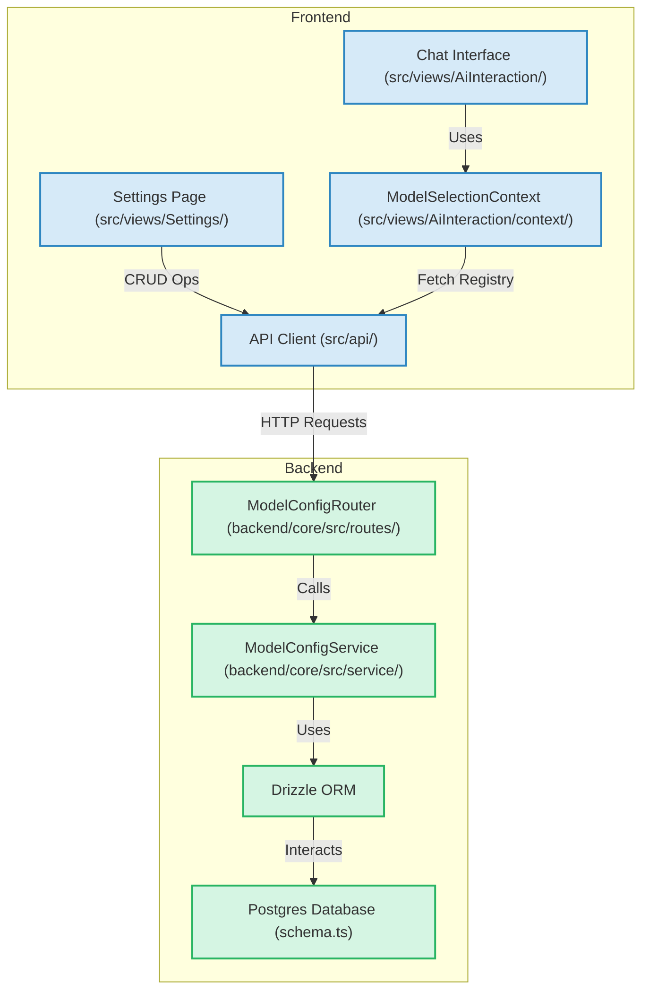

# Project Plan: Dynamic AI Model Configuration

**Goal:** To allow users to configure AI model providers (name, SDK ID, API key, image) and their associated models (name, SDK ID, default status) through a settings UI, storing these configurations in the backend database and using them to populate the model selection in the chat interface.

**Phase 1: Backend - Database and Service Layer**

1.  **Refine Database Schema ([`backend/core/src/db/schema.ts`](backend/core/src/db/schema.ts))**

    - Rename the `users` table to `providers`.
    - Rename the `models` table to `provider_models`.
    - **`providers` table:**
      - `id`: `integer` (PK, auto-increment)
      - `name`: `varchar(255)` (User-friendly name, e.g., "OpenAI", should be unique)
      - `provider_sdk_id`: `varchar(255)` (SDK identifier, e.g., "openai", should be unique)
      - `base_url`: `varchar(255)` (Optional, for self-hosted or custom endpoints)
      - `api_key`: `varchar(255)` (Encrypted at rest is recommended, but for now, as per schema)
      - `image_url`: `varchar(255)` (Path to provider logo, e.g., `"/images/providers/openai.png"`)
      - `created_at`: `integer` (Unix timestamp)
      - `updated_at`: `integer` (Unix timestamp)
    - **`provider_models` table:**
      - `id`: `integer` (PK, auto-increment)
      - `provider_id`: `integer` (FK to `providers.id`)
      - `name`: `varchar(255)` (User-friendly model name, e.g., "GPT-4o Mini")
      - `model_sdk_id`: `varchar(255)` (Full SDK model ID, e.g., "openai:gpt-4o-mini")
        - Add a composite unique constraint: `unique(provider_id, model_sdk_id)`
      - `is_default`: `boolean` (or `integer` `0`/`1`, default `false`). Only one model globally can be true.
      - `is_enabled`: `boolean` (or `integer` `0`/`1`, default `true`)
      - `created_at`: `integer` (Unix timestamp)
      - `updated_at`: `integer` (Unix timestamp)

    ```mermaid
    erDiagram
        providers {
            integer id PK
            varchar name UK "User-friendly name (e.g., OpenAI)"
            varchar provider_sdk_id UK "SDK ID (e.g., openai)"
            varchar base_url "Optional base URL"
            varchar api_key "API Key"
            varchar image_url "Logo image path"
            integer created_at
            integer updated_at
        }
        provider_models {
            integer id PK
            integer provider_id FK "References providers.id"
            varchar name "User-friendly model name"
            varchar model_sdk_id "Full SDK model ID (e.g., openai:gpt-4o)"
            boolean is_default "Global default model"
            boolean is_enabled "Is model enabled"
            integer created_at
            integer updated_at
            UNIQUE (provider_id, model_sdk_id)
        }
        providers ||--o{ provider_models : "has"
    ```

2.  **Create Backend Service Layer ([`backend/core/src/service/modelConfigService.ts`](backend/core/src/service/modelConfigService.ts))**
    - Implement CRUD functions for `providers` and `provider_models` using Drizzle ORM.
      - `createProvider(data)`
      - `getProviders()`
      - `getProviderById(id)`
      - `updateProvider(id, data)`
      - `deleteProvider(id)` (Handle cascading deletes or prevent deletion if models exist)
      - `createModel(data)`
      - `getModelsByProviderId(providerId)`
      - `getModelById(id)`
      - `updateModel(id, data)`
      - `deleteModel(id)`
      - `setDefaultModel(modelId)`: Sets the specified model's `is_default` to true and all others to false.
    - Implement `getFormattedModelRegistry(): Promise<ModelProvider[]>`:
      - Fetches all enabled providers and their enabled models.
      - Formats the data to match the `ModelProvider[]` structure currently used in [`src/views/AiInteraction/utils/constants.ts`](src/views/AiInteraction/utils/constants.ts) (i.e., an array of providers, each with a nested array of its models).
      - Identifies the `DEFAULT_MODEL_ID` from the model marked as `is_default: true`.

**Phase 2: Backend - API Routes**

3.  **Create API Routes ([`backend/core/src/routes/modelConfigRouter.ts`](backend/core/src/routes/modelConfigRouter.ts))**
    - Use Hono and `zValidator` for request validation.
    - **Provider Endpoints (e.g., under `/api/config/providers`):**
      - `POST /`: Create a new provider.
      - `GET /`: Get all providers.
      - `GET /:id`: Get a specific provider.
      - `PUT /:id`: Update a provider.
      - `DELETE /:id`: Delete a provider.
    - **Model Endpoints (e.g., under `/api/config/models`):**
      - `POST /`: Create a new model (requires `provider_id`).
      - `GET /provider/:providerId`: Get all models for a specific provider.
      - `GET /:id`: Get a specific model.
      - `PUT /:id`: Update a model.
      - `DELETE /:id`: Delete a model.
      - `POST /:id/set-default`: Set a model as the global default.
    - **Frontend Data Endpoint:**
      - `GET /api/model-registry`: Calls `modelConfigService.getFormattedModelRegistry()` to provide data for the model selection UI.
    - Integrate this new router into your main Hono application (likely in [`backend/core/index.ts`](backend/core/index.ts)).

**Phase 3: Frontend Development**

4.  **Update API Client and Model Selection Context**

    - **API Client ([`src/api/client.ts`](src/api/client.ts) or a new `src/api/configClient.ts`):**
      - Add functions to interact with all the new backend endpoints defined in `modelConfigRouter.ts`.
    - **Refactor `ModelSelectionContext` ([`src/views/AiInteraction/context/ModelSelectionContext.tsx`](src/views/AiInteraction/context/ModelSelectionContext.tsx)):**
      - Remove direct import of `availableModelsRegistry` and `DEFAULT_MODEL_ID` from [`constants.ts`](src/views/AiInteraction/utils/constants.ts).
      - Use `useEffect` to fetch the model registry from the `/api/model-registry` endpoint on component mount.
      - The fetched data will include the list of providers and models, and also indicate which model is the default.
      - Update `selectedModelId` state with the fetched default model ID.
      - Update `modelProviders` state with the fetched list.
      - Handle loading and error states during the fetch.

5.  **Create Settings UI (e.g., new view in `src/views/Settings/ModelConfigurationPage.tsx`)**
    - **Main Page Layout:**
      - Display a list of currently configured providers.
      - Button to "Add New Provider".
    - **Provider Management:**
      - Each provider in the list should show its name, image, and have "Edit" / "Delete" options.
      - Clicking "Edit" or "Add New Provider" opens a form/modal to input/modify:
        - Provider Name (user-friendly)
        - Provider SDK ID (e.g., `groq`, `openai`)
        - API Key
        - Base URL (optional)
        - Image URL (could be a text input, or perhaps a predefined list if images are local)
    - **Model Management (within each provider's view/edit section):**
      - List models associated with the provider.
      - Button to "Add New Model" to that provider.
      - Each model shows its name, SDK ID, and status (enabled/disabled, default).
      - Options to "Edit" / "Delete" / "Set as Global Default" / "Enable/Disable" for each model.
      - Form/modal for adding/editing models:
        - Model Name (user-friendly)
        - Model SDK ID (e.g., `openai:gpt-4o-mini`)
    - All CRUD operations will use the API client functions created in step 4.

**Phase 4: Database Migration and Finalization**

6.  **Database Migration:**
    - Once the schema changes in [`backend/core/src/db/schema.ts`](backend/core/src/db/schema.ts) are finalized, generate a new Drizzle migration script.
    - Apply the migration to your database.
7.  **Testing and Refinement:**
    - Thoroughly test the entire workflow: adding providers, adding models, setting defaults, editing, deleting.
    - Verify the chat interface correctly loads and uses the configured models.
    - Ensure error handling is robust on both frontend and backend.

**Overall Architecture Diagram:**


